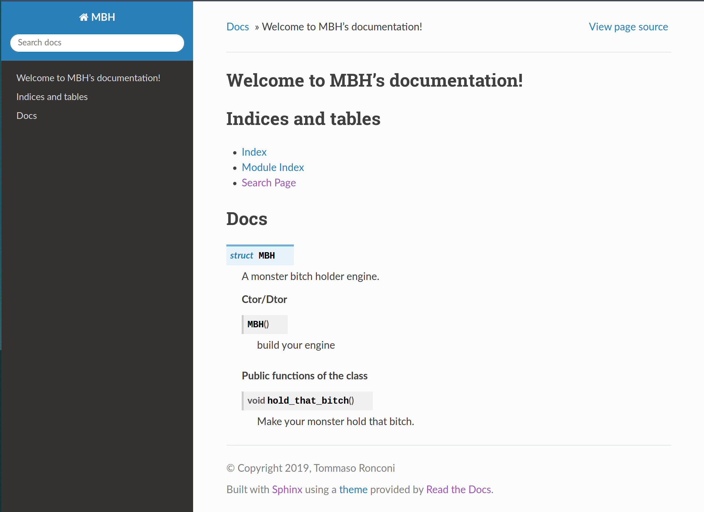

# TFM of MBH

This is a template module for documenting an hybrid code using a blend of
- Sphinx
- Breathe
- Doxygen
- Meson

Be(a)ware of The F***ing Manual!!

All the credit goes to [Sy Brand's tutorial](https://devblogs.microsoft.com/cppblog/clear-functional-c-documentation-with-sphinx-breathe-doxygen-cmake/) who
implemented basicaly the same thing but using `CMake`. I have just ported it to `meson`.

**_Note_** The name _MBH_ refers to a cool [Instagram profile](https://www.instagram.com/monstersholdingbitches/) that you will love, if you are a weirdo like myself...

## Dependencies

All of these are available in `conda`:
- meson
- ninja
- sphinx
- breathe

Thus you could just create the `doc` environment with the kindly provided yaml: [doc_environment.yml](useful/doc_environment.yml).

| If you do not have Anaconda or Miniconda, these packages are also available with `pip` |
| :------------------------------------------------------------------------------------: |
| ... but there must be something wrong with you.                                        |

Other dependency you do not want to forget:
- Doxygen

But you'll have to install this manualy (_"ehy! what year is this? 2005??"_).

## Make it fly

**Advice for dummies:** If you followed my advice of creating a conda environment, you might want to activate it before starting:
```bash
conda activate doc
```

Once everything has been set-up we are ready to go.
From the root directory of this repository type:
```bash
meson build_dir
cd build_dir
ninja install
```

If we (you) have done everything right, now you should have an `install` directory in the root of the repository with this structure:
```bash
.
├── include
│   └── mbh.h
├── lib
│   └── libmbh.so
└── share
    └── man
        ├── html
        │   ├── genindex.html
        │   ├── index.html
        │   ├── objects.inv
        │   ├── search.html
        │   ├── searchindex.js
        │   ├── _sources
        │   │   └── index.rst.txt
        │   └── _static
        │       ├── basic.css
        │       └── ...
        └── xml
            ├── ...
            ├── index.xml
            └── ...

13 directories, 62 files
```

If you point your browser to the `share/man/html/index.html` file, you should see something like this:



Congrats, you made your first authomated documentation page, you want to make it fancier? **RTFMs!!**

**_Note_** If you do not want to generate the `build_dir` or the `install` directory in this repository, just change the paths when running the `meson` command:
```bash
meson /path/to/build_dir -Dprefix=/another/path/to/install_dir
cd /path/to/build_dir
ninja install
```